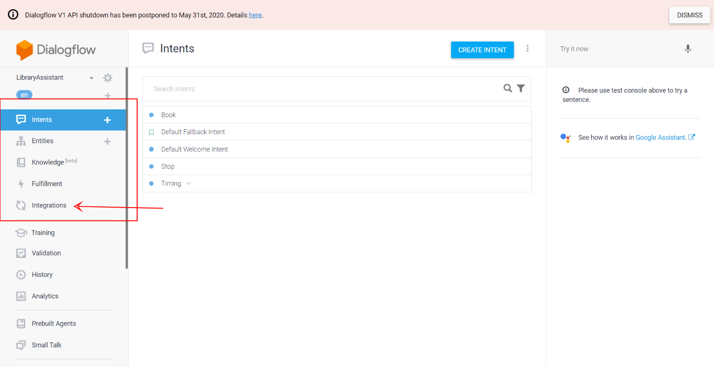
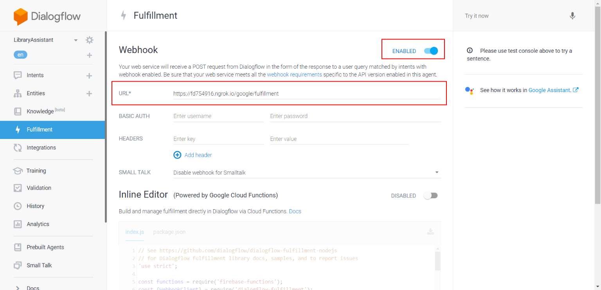

# Google-Alexa-Middleware
Google Assistant and Alexa app middleware in Node.js

## Requirements

* Node v12.14.0
* A Google action created on console.actions.google.
* Ngrok (if this is used locally).

* Step 1: Download/Clone the repository on your computer.
* Step 2: From the folder `<root of the repository>` and run `npm install`.
* Step 3: Run `npm run start:app`, this will start the local app on port `8081` by default.
* Step 3.1: (If working locally), on a separate terminal run `ngrok http port_number` - `ngrok http 8080` and write down the url.

## Set up on Dialogflow

### Step 1:

Go to `https://dialogflow.cloud.google.com/`

### Step 2:

Select your Diagflow project and Go to `Fulfillment`

### Step 3:

Enable Webhook integration and copy your `ngrok` URL or `Lambda` URL.

## Webhook

### /google

- Google intent request and response parsing

### Intents for dialogflow

- Check `routes\google.js` and logic in `controller\google.js`

#### Welcome Intent

Name: `GOOGLE_ASSISTANT_WELCOME` OR `Default Welcome Intent`

#### Fallback Intent

Name: `Default Fallback Intent`

#### Help Intent

Name: `help`

### Exit Conversation 

Name: `exit_conversation`

## Recommendation Library

- Dialogflow Website: `https://developers.google.com/assistant/actions/reference/nodejsv2/overview`
- Github: `https://github.com/actions-on-google/actions-on-google-nodejs`
- NPM: `https://www.npmjs.com/package/actions-on-google`

## Tech stack & Libraries

- Check `package.json` file for used libraries and version

## Author

**Vatsal Shah**

[**PORTFOLIO**](https://vatsalshah.in) | [**GITHUB**](https://github.com/vatsal2210) | [**BLOG**](https://vatsalshah.in/blog)

If you like my stuff and hate spam, I can send my upcoming articles to your inbox. One-click unsubscribe anytime — [**Click here to join my newsletter**](https://vatsalshah.substack.com/subscribe) 💌

If you’re feeling generous today, you can [**buy me a coffee**](https://www.buymeacoffee.com/vatsalshah) ☕
